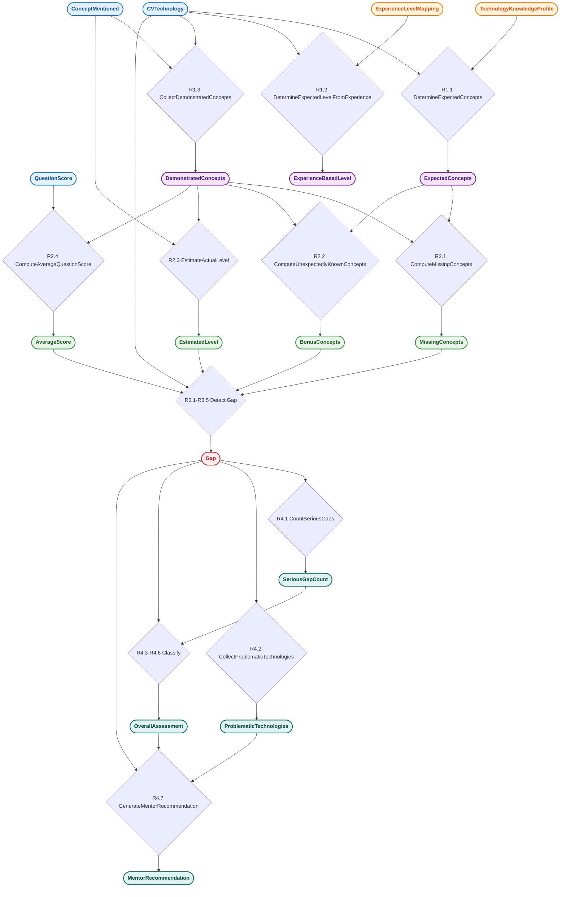

# Klasni dijagram

## Pregled

Model je organizovan u 4 paketa:

- **`com.ftn.sbnz.model.cv`** — ulazni podaci iz CV-a
- **`com.ftn.sbnz.model.interview`** — ulazni podaci iz intervjua
- **`com.ftn.sbnz.model.kb`** — domenska baza znanja
- **`com.ftn.sbnz.model.facts`** — činjenice koje pravila kreiraju kroz lančanje

Sve klase imaju `candidateId` polje koje se koristi kao primarni način
povezivanja činjenica u Drools pravilima (`when` uslovi po `candidateId == $cId`).

## Dijagram

```mermaid
classDiagram
    direction LR

    %% ============ ENUMI ============
    class ExpertiseLevel {
        <<enumeration>>
        BEGINNER
        JUNIOR
        MID
        SENIOR
        EXPERT
        +int rank
        +getRank() int
    }

    class GapType {
        <<enumeration>>
        OVERSTATED
        MATCHED
        UNDERSTATED
    }

    class GapSeverity {
        <<enumeration>>
        NONE
        MINOR
        MODERATE
        MAJOR
        CRITICAL
    }

    class OverallClassification {
        <<enumeration>>
        RELIABLE_CV
        MINOR_INCONSISTENCIES
        SIGNIFICANT_GAPS
        UNRELIABLE_CV
    }

    %% ============ ULAZ: CV ============
    class CVTechnology {
        +String candidateId
        +String technology
        +ExpertiseLevel claimedLevel
        +int yearsOfExperience
    }

    %% ============ ULAZ: INTERVIEW ============
    class ConceptMentioned {
        +String candidateId
        +String technology
        +String concept
        +int difficultyWeight
    }

    class QuestionScore {
        +String candidateId
        +String technology
        +String questionId
        +double score
    }

    %% ============ BAZA ZNANJA ============
    class TechnologyKnowledgeProfile {
        +String technology
        +ExpertiseLevel level
        +Set~String~ expectedConcepts
    }

    class ExperienceLevelMapping {
        +int minYears
        +int maxYears
        +ExpertiseLevel level
    }

    %% ============ NIVO 1 - generisane činjenice ============
    class ExpectedConcepts {
        +String candidateId
        +String technology
        +ExpertiseLevel level
        +Set~String~ conceptList
    }

    class DemonstratedConcepts {
        +String candidateId
        +String technology
        +Set~String~ conceptList
    }

    class ExperienceBasedLevel {
        +String candidateId
        +String technology
        +ExpertiseLevel level
    }

    %% ============ NIVO 2 - generisane činjenice ============
    class MissingConcepts {
        +String candidateId
        +String technology
        +Set~String~ missingList
        +int expectedSize
        +getMissingRatio() double
    }

    class BonusConcepts {
        +String candidateId
        +String technology
        +Set~String~ bonusList
    }

    class EstimatedLevel {
        +String candidateId
        +String technology
        +ExpertiseLevel level
        +int score
    }

    class AverageScore {
        +String candidateId
        +String technology
        +double avgScore
    }

    %% ============ NIVO 3 - generisane činjenice ============
    class Gap {
        +String candidateId
        +String technology
        +GapType type
        +GapSeverity severity
        +ExpertiseLevel claimedLevel
        +ExpertiseLevel estimatedLevel
        +Set~String~ missingConcepts
        +Set~String~ bonusConcepts
    }

    %% ============ NIVO 4 - generisane činjenice ============
    class SeriousGapCount {
        +String candidateId
        +int count
    }

    class ProblematicTechnologies {
        +String candidateId
        +List~String~ techList
    }

    class OverallAssessment {
        +String candidateId
        +OverallClassification classification
    }

    class MentorRecommendation {
        +String candidateId
        +List~String~ problematicTechnologies
        +Map~String,Set~ conceptsToVerify
        +String summary
    }

    %% ============ Asocijacije ============
    CVTechnology --> ExpertiseLevel
    TechnologyKnowledgeProfile --> ExpertiseLevel
    ExperienceLevelMapping --> ExpertiseLevel
    ExpectedConcepts --> ExpertiseLevel
    ExperienceBasedLevel --> ExpertiseLevel
    EstimatedLevel --> ExpertiseLevel

    Gap --> GapType
    Gap --> GapSeverity
    Gap --> ExpertiseLevel

    OverallAssessment --> OverallClassification
```

## Tok podataka kroz pravila

## Legenda

- 🟦 **Plavo** — ulazni podaci od korisnika (REST request)
- 🟧 **Narandžasto** — domenska baza znanja (seedovana pre svake analize)
- 🟪 **Ljubičasto** — činjenice Nivoa 1
- 🟩 **Zeleno** — činjenice Nivoa 2
- 🟥 **Crveno** — činjenice Nivoa 3 (Gap)
- 🩵 **Tirkizno (teal)** — činjenice Nivoa 4 (sumarna procena)
